# Workflow Catalog

## Purpose

Every data mutation and read in the system is described here as a **flow**.
Each flow specifies its trigger, preconditions, sequence (tables affected and order),
postconditions, and integrity rules. Complex multi-table operations are broken into
ordered steps to make atomicity and failure modes visible.

This document is the single source of truth for verifying data integrity across
the application. If a UI action, API call, or scheduled job is not listed here,
it does not exist.

---

## Domain Map

### Entity Relationships

```
currencies ──┐
             ├──< market_assets.currency_code
             ├──< transactions.currency
             ├──< transactions.payment_currency
             ├──< transactions.dividend_currency
             ├──< transactions.dividend_payment_currency
             ├──< transaction_fees.currency
             ├──< transaction_taxes.currency
             ├──< schedules.currency
             └──< prices (no FK but logically tied via market_assets)

entities ────┬──< transactions.entity_id
             ├──< portfolio_assets (no direct FK — via transactions)
             └──< schedules.entity_id

market_assets ────< portfolio_assets.market_code
                │  < prices.market_code
                └──< transactions.portfolio_asset_id (via portfolio_assets)

portfolio_assets ──< transactions.portfolio_asset_id

transactions ────< transaction_fees.transaction_id
               │  < transaction_taxes.transaction_id

fiscal_exemptions ──< transactions.fiscal_exemption_id

balance_snapshots
  └── Anchors the cash balance of an (entity, currency) pair at a point in time.
      Transactions with timestamp <= snapshot.timestamp are excluded from
      incremental cash balance computation for that pair.

schedules
  └── Embeds: total_value, currency, entity_id, type, notes.
      Also may embed portfolio_asset_id, quantity, unit_price,
      transaction_category for investment-type schedules.
      The schedule is self-contained and does not create a template row in
      transactions.
```

### Table Write Dependencies

| Table | Depends On | Referenced By |
| ----- | ---------- | ------------- |
| `currencies` | nothing | everything |
| `entities` | nothing | transactions, schedules, balance_snapshots |
| `market_assets` | currencies | portfolio_assets, prices |
| `portfolio_assets` | market_assets | transactions |
| `fiscal_exemptions` | nothing | transactions |
| `transactions` | entities, currencies, portfolio_assets (opt), fiscal_exemptions (opt) | transaction_fees, transaction_taxes |
| `transaction_fees` | transactions | nothing |
| `transaction_taxes` | transactions | nothing |
| `schedules` | entities, currencies, portfolio_assets (opt) | nothing |
| `prices` | market_assets | nothing |
| `balance_snapshots` | entities, currencies | nothing |

### Write Ordering Rule

> A table must contain a referenced row **before** the referencing table writes.
> The exception is schedules: they embed their own data and do NOT depend on a
> pre-existing transaction.

---

## Conventions

| Convention | Rule |
| ---------- | ---- |
| **FK validation** | Always performed in the service layer before calling the query layer. The `_resolve_fks()` helper in `transaction_svc` is the canonical pattern. |
| **Atomicity** | Guaranteed by database transactions: a single `commit()` at the end of a multi-step operation, with `rollback()` on any exception. |
| **Soft delete** | Only `entities` (`deleted_at` column). All other tables use hard `DELETE`. |
| **Future-timestamp filter** | Cash-balance analytics apply `WHERE timestamp <= datetime('now')` to exclude template/future transactions. This filter is NOT applied to read-back queries (`GET /transactions`) or to schedule projection — those show all committed data. |
| **Periodicity-to-Cron** | The scheduler converts `PeriodicityType` to APScheduler cron expressions for daily, weekly (same weekday as start), monthly (same day-of-month), quarterly, annually (exact month+day). `ONE_OFF` uses a `DateTrigger`. |
| **Schedule projection** | Occurrences are computed client-side by advancing from `schedule.start_date` at the periodicity interval, excluding the first occurrence (it will be created by the scheduler firing on `start_date`). Only future occurrences (`>= today`) are generated to avoid double-counting with realized transactions. |
| **Delete pre-check** | Before any hard DELETE, the service layer SHALL verify that no FK dependencies exist. The service handles child records (auto-delete if semantically dependent) or returns 409 Conflict with details. DB-level FK constraints are a safety net only, NOT a flow-control mechanism. |

---

## Flow Catalog

---

### 1. Currency

#### 1.1 Register a Currency Code

| Field | Value |
| ----- | ----- |
| **Trigger** | `POST /api/v1/currencies` |
| **Body** | `{ "code": "EUR" }` |
| **Scheduling** | Immediate (user action from Currencies page) |

**Preconditions**
- Code is not already registered (checked via `code_exists`).
- Code is a non-empty string (validated by model).

**Sequence**

| Step | Table | SQL | Notes |
| ---- | ----- | --- | ----- |
| 1 | `currencies` | `SELECT 1 WHERE code = ? OR base_code = ? LIMIT 1` | Existence check (both directions) |
| 2 | `currencies` | `INSERT INTO currencies (code, base_code, rate, timestamp) VALUES (?, ?, 1.0, ?)` | Self-rate of 1.0 at current time |

**Postconditions**
- A new row exists in `currencies` with `code = base_code`.
- The code appears in `GET /currencies` responses.

**Integrity**
- Composite PK: `(code, base_code, timestamp)`. Self-rate insert is safe.
- 409 if code already exists (in either column).

**Edge Cases**
- Code already exists as a `base_code` but not as a `code`: treated as already registered.

---

#### 1.2 Record an Exchange Rate

| Field | Value |
| ----- | ----- |
| **Trigger** | `POST /api/v1/currencies/rates` |
| **Body** | `{ "code": "EUR", "base_code": "USD", "rate": 1.09, "timestamp": "..." }` |

**Preconditions**
- Both `code` and `base_code` are registered.
- The reverse pair does NOT exist (e.g., `USD/EUR` when inserting `EUR/USD`).

**Sequence**

| Step | Table | SQL | Notes |
| ---- | ----- | --- | ----- |
| 1 | `currencies` | `SELECT 1 WHERE code = ? AND base_code = ? LIMIT 1` | Check reverse pair |
| 2 | `currencies` | `INSERT INTO currencies (code, base_code, rate, timestamp) VALUES (?, ?, ?, ?)` | Insert the rate |

**Integrity**
- Reverse pair existence → 409. User must upsert the existing pair instead.

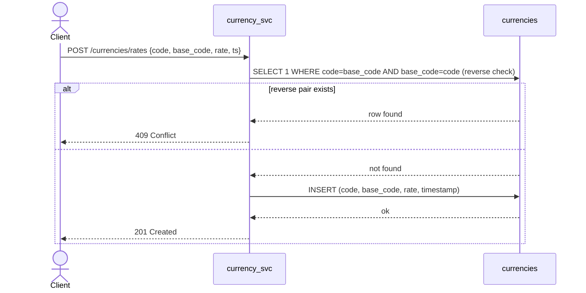
```mermaid
sequenceDiagram
    actor Client
    participant Svc as currency_svc
    participant DB as currencies

    Client->>Svc: POST /currencies/rates {code, base_code, rate, ts}
    Svc->>DB: SELECT 1 WHERE code=base_code AND base_code=code (reverse check)
    alt reverse pair exists
        DB-->>Svc: row found
        Svc-->>Client: 409 Conflict
    else
        DB-->>Svc: not found
        Svc->>DB: INSERT (code, base_code, rate, timestamp)
        DB-->>Svc: ok
        Svc-->>Client: 201 Created
    end
```

---

#### 1.3 Get Latest Rate (with Auto-Inversion)

| Field | Value |
| ----- | ----- |
| **Trigger** | `GET /api/v1/currencies/rates/{code}/{base_code}` |
| **Query** | `?at=2026-06-01` (optional) |

**Sequence**

| Step | Notes |
| ---- | ----- |
| 1 | Try direct pair: `SELECT ... WHERE code=? AND base_code=? ORDER BY timestamp DESC LIMIT 1` |
| 2 | If not found, try reverse: `(base_code, code)` |
| 3 | If reverse found: return `rate = 1 / reverse.rate` with `inverted = True` |

**Postconditions**
- A rate is returned (or 404 if neither direction has data).
- If `at` is provided, the nearest rate by `julianday` difference is returned.

**Integrity**
- At least one direction must have data.
- The `inverted` flag lets the consumer know the rate was derived.

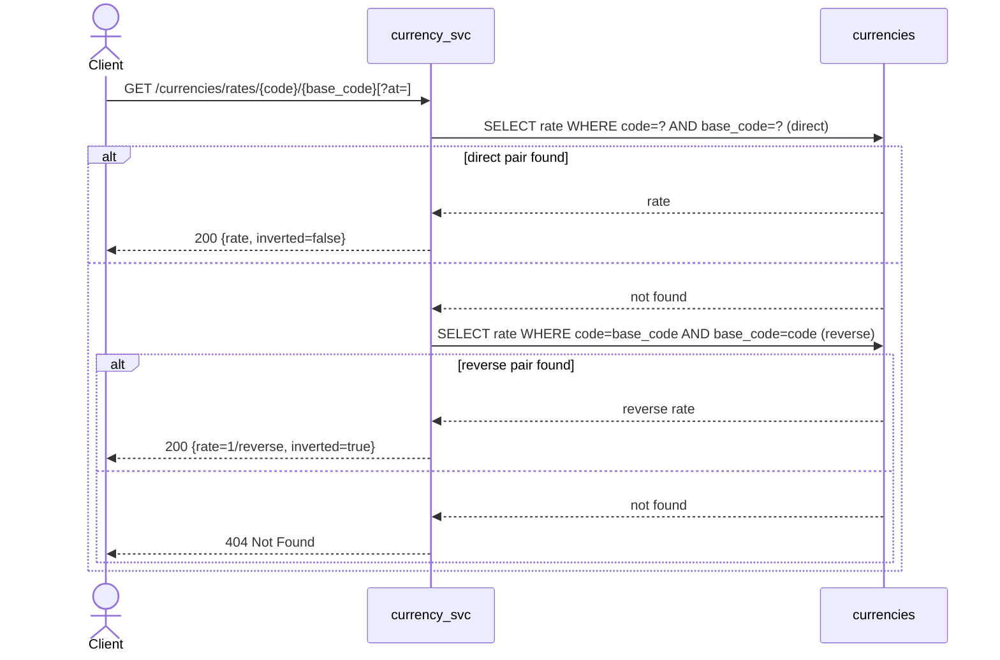
```mermaid
sequenceDiagram
    actor Client
    participant Svc as currency_svc
    participant DB as currencies

    Client->>Svc: GET /currencies/rates/{code}/{base_code}[?at=]
    Svc->>DB: SELECT rate WHERE code=? AND base_code=? (direct)
    alt direct pair found
        DB-->>Svc: rate
        Svc-->>Client: 200 {rate, inverted=false}
    else
        DB-->>Svc: not found
        Svc->>DB: SELECT rate WHERE code=base_code AND base_code=code (reverse)
        alt reverse pair found
            DB-->>Svc: reverse rate
            Svc-->>Client: 200 {rate=1/reverse, inverted=true}
        else
            DB-->>Svc: not found
            Svc-->>Client: 404 Not Found
        end
    end
```

---

#### 1.4 Bulk-Upsert Rates

| Field | Value |
| ----- | ----- |
| **Trigger** | `PUT /api/v1/currencies/rates/{code}/{base_code}` |
| **Body** | `{ "timestamps": [...], "rates": [...] }` |

**Preconditions**
- Reverse pair must NOT exist (e.g., USD/EUR when upserting EUR/USD).

**Sequence**

| Step | SQL |
| ---- | --- |
| 1 | Check reverse pair does not exist |
| 2 | For each (ts, rate): `INSERT INTO currencies (code, base_code, rate, timestamp) VALUES (?, ?, ?, ?) ON CONFLICT(code, base_code, timestamp) DO UPDATE SET rate = ?` |

**Integrity**
- Arrays must have equal length (validated by model). Non-empty.
- Reverse pair exists → 409.
- If pair does not exist yet, the INSERT creates it (true upsert).

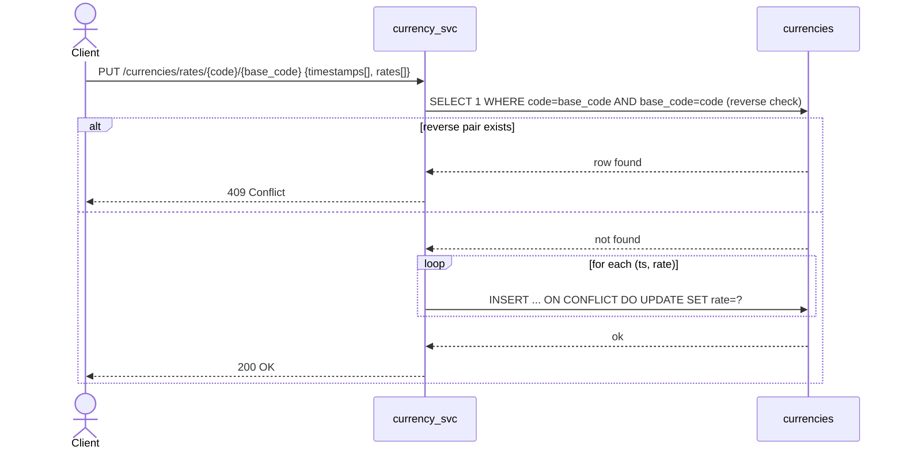
```mermaid
sequenceDiagram
    actor Client
    participant Svc as currency_svc
    participant DB as currencies

    Client->>Svc: PUT /currencies/rates/{code}/{base_code} {timestamps[], rates[]}
    Svc->>DB: SELECT 1 WHERE code=base_code AND base_code=code (reverse check)
    alt reverse pair exists
        DB-->>Svc: row found
        Svc-->>Client: 409 Conflict
    else
        DB-->>Svc: not found
        loop for each (ts, rate)
            Svc->>DB: INSERT ... ON CONFLICT DO UPDATE SET rate=?
        end
        DB-->>Svc: ok
        Svc-->>Client: 200 OK
    end
```

---

#### 1.5 Delete Currency Pair

`DELETE /api/v1/currencies/rates/{code}/{base_code}` → removes all rows for the pair.
Codes remain registered.

---

#### 1.6 Delete a Currency Code (Cascade)

`DELETE /api/v1/currencies/{code}` → `DELETE FROM currencies WHERE code=? OR base_code=?`

**Integrity**
- If a transaction or schedule references the code, FK constraint raises an error.
  The service catches it and returns 409.
- The frontend shows a user-friendly message.

---

### 2. Entity

#### 2.1 Create Entity

`POST /api/v1/entities` → `INSERT INTO entities (name, entity_type, country, description)`

| Integrity | Rule |
| --------- | ---- |
| Uniqueness | Duplicate `(name, entity_type)` for non-deleted rows → 409 |
| `entity_type` | Must be one of `BROKER, BANK, EMPLOYER, EXCHANGE, OTHER` |

#### 2.2 Edit Entity

`PUT /api/v1/entities/{id}` → `UPDATE entities SET ... WHERE id=?`

- 404 if entity does not exist or is soft-deleted.
- 409 if new `(name, entity_type)` conflicts.

#### 2.3 Soft-Delete Entity

`DELETE /api/v1/entities/{id}` → `UPDATE entities SET deleted_at=datetime('now') WHERE id=?`

| Step | Table | SQL |
| ---- | ----- | --- |
| 1 | `transactions` | `SELECT 1 FROM transactions WHERE entity_id=? LIMIT 1` — if found, REJECT (409) |
| 1.5 | `schedules` | `SELECT 1 FROM schedules WHERE entity_id=? LIMIT 1` — if found, REJECT (409) |
| 2 | `entities` | Soft-delete |

**Integrity**
- If transactions or schedules reference the entity, deletion is rejected (409).

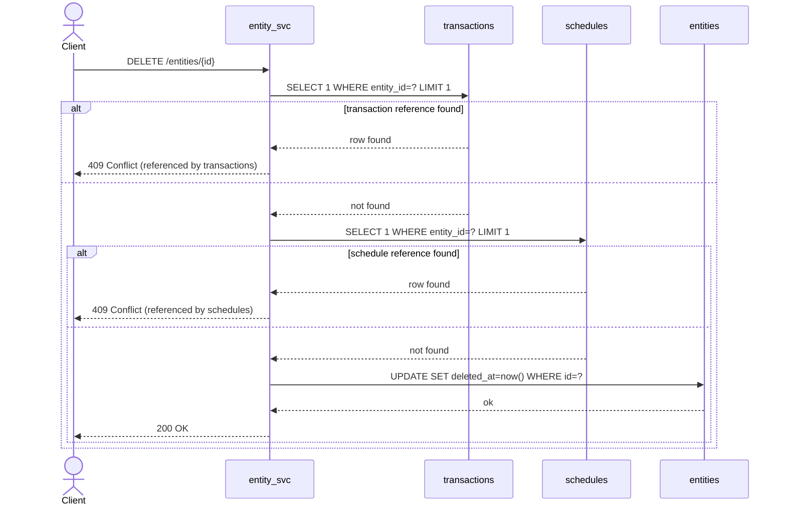
```mermaid
sequenceDiagram
    actor Client
    participant Svc as entity_svc
    participant DB_tx as transactions
    participant DB_sc as schedules
    participant DB_en as entities

    Client->>Svc: DELETE /entities/{id}
    Svc->>DB_tx: SELECT 1 WHERE entity_id=? LIMIT 1
    alt transaction reference found
        DB_tx-->>Svc: row found
        Svc-->>Client: 409 Conflict (referenced by transactions)
    else
        DB_tx-->>Svc: not found
        Svc->>DB_sc: SELECT 1 WHERE entity_id=? LIMIT 1
        alt schedule reference found
            DB_sc-->>Svc: row found
            Svc-->>Client: 409 Conflict (referenced by schedules)
        else
            DB_sc-->>Svc: not found
            Svc->>DB_en: UPDATE SET deleted_at=now() WHERE id=?
            DB_en-->>Svc: ok
            Svc-->>Client: 200 OK
        end
    end
```

---

### 3. Market Asset

#### 3.1 Create Market Asset

`POST /api/v1/market-assets` → insert into `market_assets`.
- References `currencies(code)`.
- Duplicate `market_code` → 409.
- Unknown `currency_code` → 422.

#### 3.2 Edit / Delete

Standard PUT/DELETE. No soft delete. If `portfolio_assets` references the asset,
DELETE fails at the FK level.

---

### 4. Portfolio Asset

#### 4.1 Add Asset to Portfolio

`POST /api/v1/portfolio-assets` → insert into `portfolio_assets`.

| Field | Source |
| ----- | ------ |
| `market_code` | Must exist in `market_assets` |
| `tracking_mode` | `auto` (default) or `manual` |
| `is_active` | `true` (default) — set to `false` to close a position |
| `layer` | `core`, `reserve`, or `satellite` |
| `dca_status` | `ongoing`, `paused`, or `closed` |

**Integrity**
- `market_code` FK → `market_assets`.
- Active portfolio assets are the source of truth for holdings analytics.

#### 4.2 Edit / Remove

Standard PUT/DELETE. Hard delete. FK protected by `transactions.portfolio_asset_id`.

---

### 5. Transaction (Single)

#### 5.1 Create Single Transaction

| Field | Value |
| ----- | ----- |
| **Trigger** | `POST /api/v1/transactions` |
| **Body** | `TransactionCreate` |
| **Scheduling** | Immediate (AddIncomeModal one-time mode, AddAssetModal, manual entry) |

**Preconditions**
- `entity_id` exists in `entities` (not soft-deleted).
- `currency` exists in `currencies`.
- `portfolio_asset_id` (if provided) exists in `portfolio_assets`.
- `fiscal_exemption_id` (if provided) exists in `fiscal_exemptions`.
- All payment/dividend currency codes exist.
- If a `balance_snapshot` exists for the same `(entity_id, currency)`: `timestamp` must be strictly greater than the snapshot's `timestamp`. If not, reject with 409 and surface the snapshot date to the caller.

All FK checks are performed by `_resolve_fks()` in `transaction_svc` before INSERT.

**Sequence**

| Step | Table | SQL |
| ---- | ----- | --- |
| 1 | — | `_resolve_fks(conn, body)` — validates all FK references |
| 2 | — | Compute `total_value` if not provided: `quantity * unit_price` |
| 3 | `transactions` | `INSERT INTO transactions (...) VALUES (...)` |

**Postconditions**
- A new row in `transactions`. The transaction appears in:
  - `GET /transactions`
  - `GET /analytics/cash-flow` (if within date range, filtered by `timestamp <= now`)
  - `GET /analytics/income-by-source` (if type is MONEY_IN/INTEREST/DIVIDEND)
  - Holdings, dividends, P&L queries depending on type

**Transaction Types and Their Effects**

| Type | Effect on Analytics |
| ---- | ------------------- |
| `MONEY_IN` | Increases cash balance, counted as income source |
| `MONEY_OUT` | Decreases cash balance |
| `INTEREST` | Increases cash balance, counted as income source |
| `DIVIDEND` | Increases cash balance (if cash), counted as income source |
| `INVESTMENT_BUY` | Increases cost basis, decreases cash balance |
| `INVESTMENT_SELL` | Decreases cost basis, increases cash balance, triggers realized P&L in FIFO |
| `TRANSFER` | Neutral — used in pairs by Transfer flow |

**Integrity**
- Atomic: single INSERT. No partial state possible.
- `_resolve_fks` fails fast with `FKNotFound` (400) before any write.

---

#### 5.2 Create Full Transaction (with Fees + Taxes)

| Field | Value |
| ----- | ----- |
| **Trigger** | `POST /api/v1/transactions/full` |
| **Body** | `FullTransactionCreate` = `{ transaction: TransactionCreate, fees: [FeeInner], taxes: [TaxInner] }` |

**Sequence**

| Step | Table | SQL |
| ---- | ----- | --- |
| 1 | — | `_resolve_fks` for the transaction |
| 2 | `transactions` | INSERT transaction |
| 3 | `transaction_fees` | For each fee: INSERT with `transaction_id = new tx.id` |
| 4 | `transaction_taxes` | For each tax: INSERT with `transaction_id = new tx.id` |
| 5 | — | `commit()` |

**Atomicity**
- If any fee or tax INSERT fails, ALL changes are rolled back.
- The response returns the full tree: `{ transaction, fees: [...], taxes: [...] }`.

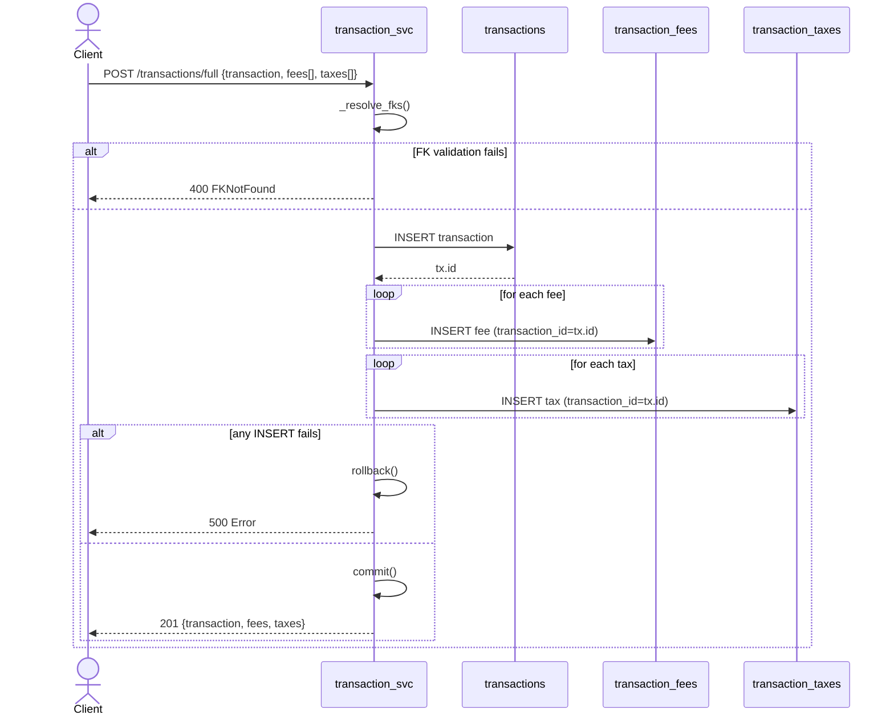
```mermaid
sequenceDiagram
    actor Client
    participant Svc as transaction_svc
    participant DB_tx as transactions
    participant DB_fe as transaction_fees
    participant DB_ta as transaction_taxes

    Client->>Svc: POST /transactions/full {transaction, fees[], taxes[]}
    Svc->>Svc: _resolve_fks()
    alt FK validation fails
        Svc-->>Client: 400 FKNotFound
    else
        Svc->>DB_tx: INSERT transaction
        DB_tx-->>Svc: tx.id
        loop for each fee
            Svc->>DB_fe: INSERT fee (transaction_id=tx.id)
        end
        loop for each tax
            Svc->>DB_ta: INSERT tax (transaction_id=tx.id)
        end
        alt any INSERT fails
            Svc->>Svc: rollback()
            Svc-->>Client: 500 Error
        else
            Svc->>Svc: commit()
            Svc-->>Client: 201 {transaction, fees, taxes}
        end
    end
```

---

#### 5.3 Batch Create Transactions

`POST /api/v1/transactions/batch` → atomic bulk INSERT.
Validates: at least one transaction in the batch.

---

#### 5.4 Edit Transaction

`PUT /api/v1/transactions/{tx_id}` → re-runs `_resolve_fks` + UPDATE.

**Integrity**
- 404 if `tx_id` not found.
- Changing `entity_id`, `currency`, or `portfolio_asset_id` re-validates FKs.
- Analytics queries (historical, FIFO) may be affected retroactively.

---

#### 5.5 Delete Transaction

`DELETE /api/v1/transactions/{tx_id}` → hard DELETE.

**Preconditions**
- The transaction must exist.

**Sequence**

| Step | Table | SQL |
| ---- | ----- | --- |
| 1 | `transaction_fees` | `DELETE FROM transaction_fees WHERE transaction_id = ?` (if any exist) |
| 2 | `transaction_taxes` | `DELETE FROM transaction_taxes WHERE transaction_id = ?` (if any exist) |
| 3 | `transactions` | `DELETE FROM transactions WHERE id = ?` |

**Integrity**
- Service deletes child fees/taxes first (they have no independent meaning without the parent transaction).
- Wrapped in an explicit transaction: if any step fails, all roll back.
- 404 if `tx_id` not found.

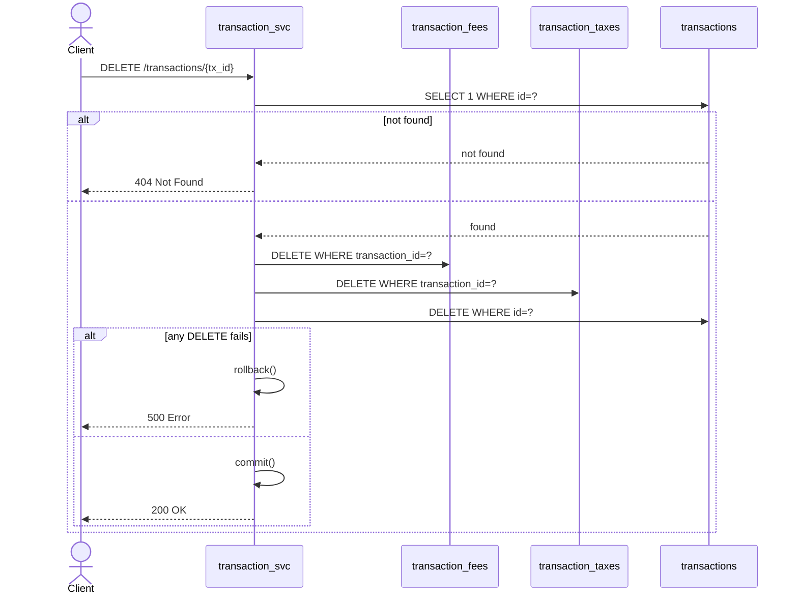
```mermaid
sequenceDiagram
    actor Client
    participant Svc as transaction_svc
    participant DB_fe as transaction_fees
    participant DB_ta as transaction_taxes
    participant DB_tx as transactions

    Client->>Svc: DELETE /transactions/{tx_id}
    Svc->>DB_tx: SELECT 1 WHERE id=?
    alt not found
        DB_tx-->>Svc: not found
        Svc-->>Client: 404 Not Found
    else
        DB_tx-->>Svc: found
        Svc->>DB_fe: DELETE WHERE transaction_id=?
        Svc->>DB_ta: DELETE WHERE transaction_id=?
        Svc->>DB_tx: DELETE WHERE id=?
        alt any DELETE fails
            Svc->>Svc: rollback()
            Svc-->>Client: 500 Error
        else
            Svc->>Svc: commit()
            Svc-->>Client: 200 OK
        end
    end
```

---

### 6. Transaction Fee & Tax

#### 6.1 Create / List / Edit / Delete

All standard CRUD on `transaction_fees` and `transaction_taxes` tables.
- `GET /transaction-fees?transaction_id=X` filters by transaction.
- `GET /transaction-taxes?transaction_id=X` filters by transaction.
- Hard delete, FK to `transactions(id)`.

---

### 7. Transfer

#### 7.1 Transfer Between Entities

| Field | Value |
| ----- | ----- |
| **Trigger** | `POST /api/v1/transfers` |
| **Body** | `TransferCreate` = `{ from_entity_id, to_entity_id, amount, currency, timestamp, notes?, fees? }` |

**Preconditions**
- `amount > 0` (validated by model).
- `from_entity_id != to_entity_id` (validated by model).
- Both entities exist.
- Currency exists.

**Sequence**

| Step | Table | SQL | Notes |
| ---- | ----- | --- | ----- |
| 1 | `transactions` | INSERT with `type = MONEY_OUT`, `entity_id = from_entity_id`, `total_value = -amount` | Outgoing leg |
| 2 | `transactions` | INSERT with `type = MONEY_IN`, `entity_id = to_entity_id`, `total_value = +amount` | Incoming leg |
| 3 | `transaction_fees` | For each fee: INSERT with `transaction_id` of the first (outgoing) leg | Fees tied to the OUT leg |
| 4 | — | `commit()` |

**Postconditions**
- 2 new rows in `transactions` (one OUT, one IN).
- Optional fee rows in `transaction_fees`.
- Cash balance of `from_entity` decreases; `to_entity` increases.

**Integrity**
- Atomic: all-or-nothing. If either INSERT fails, rollback.
- The two transactions are independent records (no FK linking them). They are
  logically paired by same `timestamp`, same `amount`, opposite types.

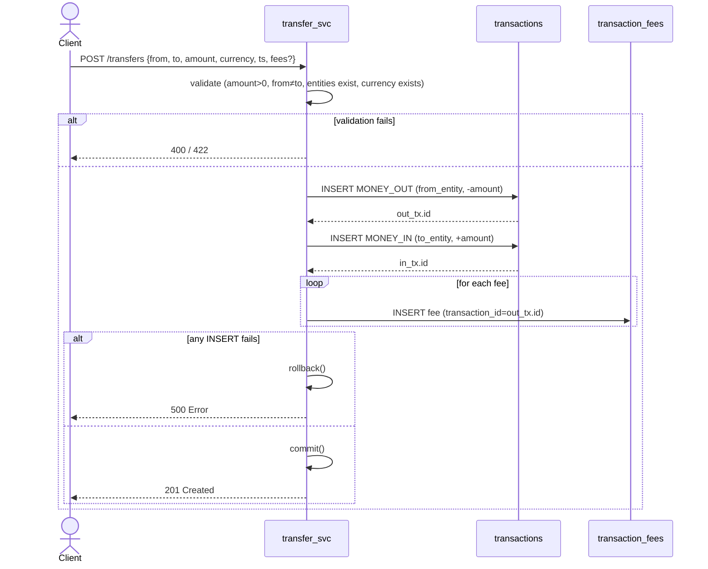
```mermaid
sequenceDiagram
    actor Client
    participant Svc as transfer_svc
    participant DB_tx as transactions
    participant DB_fe as transaction_fees

    Client->>Svc: POST /transfers {from, to, amount, currency, ts, fees?}
    Svc->>Svc: validate (amount>0, from≠to, entities exist, currency exists)
    alt validation fails
        Svc-->>Client: 400 / 422
    else
        Svc->>DB_tx: INSERT MONEY_OUT (from_entity, -amount)
        DB_tx-->>Svc: out_tx.id
        Svc->>DB_tx: INSERT MONEY_IN (to_entity, +amount)
        DB_tx-->>Svc: in_tx.id
        loop for each fee
            Svc->>DB_fe: INSERT fee (transaction_id=out_tx.id)
        end
        alt any INSERT fails
            Svc->>Svc: rollback()
            Svc-->>Client: 500 Error
        else
            Svc->>Svc: commit()
            Svc-->>Client: 201 Created
        end
    end
```

---

### 8. Schedule (Recurring Operations)

The schedule is self-contained — it embeds the fields needed to create
transactions instead of pointing to a template row in `transactions`.

#### 8.1 Create a Schedule (with Embedded Transaction Data)

| Field | Value |
| ----- | ----- |
| **Trigger** | `POST /api/v1/schedules/full` |
| **Body** | `{ schedule: { description, start_date, end_date?, periodicity_type, custom_cron?, total_value, currency, entity_id, type, notes?, ... } }` |
| **Scheduling** | Immediate (AddIncomeModal recurring mode) |

**Preconditions**
- `entity_id`, `currency`, `portfolio_asset_id` (if provided) exist.
- `start_date` is a valid date.
- `periodicity_type` is a valid `PeriodicityType`.
- If a `balance_snapshot` exists for the same `(entity_id, currency)`: `start_date` must be strictly greater than the snapshot's `timestamp`. If not, reject with 409 and surface the snapshot date to the caller.

**Sequence**

| Step | Table | SQL | Notes |
| ---- | ----- | --- | ----- |
| 1 | — | Validate FK references (entity, currency, portfolio_asset) | Same pattern as `_resolve_fks` |
| 2 | `schedules` | `INSERT INTO schedules (description, start_date, end_date, periodicity_type, custom_cron, total_value, currency, entity_id, type, notes) VALUES (...)` | No transaction created |
| 3 | — | `sync_schedule(schedule_id)` — registers the APScheduler job | Job fires at each occurrence |
| 4 | — | `commit()` | |

**Postconditions**
- A new schedule row exists with embedded transaction data.
- **No** template transaction is created in `transactions`.
- APScheduler has a recurring job for the schedule.
- The schedule appears in `GET /schedules`.

**Integrity: No Template Transaction**
- The schedule IS the source of truth for the recurring operation.
- When the scheduler fires (8.2), it reads `schedule.total_value`,
  `schedule.entity_id`, `schedule.currency`, etc. and creates a fresh
  transaction row.
- This eliminates double-counting: `transactions` contains only realized
  (fire-created) rows.

**Edge Cases**
- `ONE_OFF` periodicity: APScheduler fires once on `start_date`.
  The schedule is kept in the DB for history but the APS job auto-removes
  after firing (since there's no end_date check needed — it fires once).
- `CUSTOM` periodicity with missing `custom_cron`: the APS job is not
  registered (the `_make_trigger` function skips it).

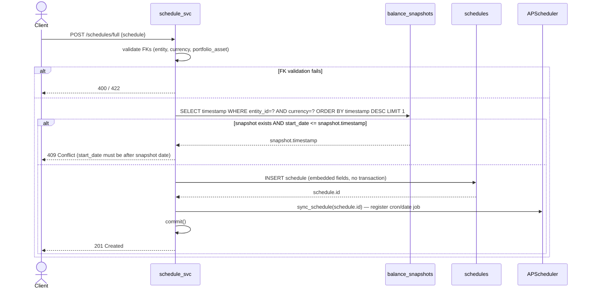
```mermaid
sequenceDiagram
    actor Client
    participant Svc as schedule_svc
    participant DB_bs as balance_snapshots
    participant DB_sc as schedules
    participant APS as APScheduler

    Client->>Svc: POST /schedules/full {schedule}
    Svc->>Svc: validate FKs (entity, currency, portfolio_asset)
    alt FK validation fails
        Svc-->>Client: 400 / 422
    else
        Svc->>DB_bs: SELECT timestamp WHERE entity_id=? AND currency=? ORDER BY timestamp DESC LIMIT 1
        alt snapshot exists AND start_date <= snapshot.timestamp
            DB_bs-->>Svc: snapshot.timestamp
            Svc-->>Client: 409 Conflict (start_date must be after snapshot date)
        else
            Svc->>DB_sc: INSERT schedule (embedded fields, no transaction)
            DB_sc-->>Svc: schedule.id
            Svc->>APS: sync_schedule(schedule.id) — register cron/date job
            Svc->>Svc: commit()
            Svc-->>Client: 201 Created
        end
    end
```

---

#### 8.2 Materialize a Schedule (Scheduler Fire → New Transaction)

| Field | Value |
| ----- | ----- |
| **Trigger** | APScheduler job fires (at the cron/date trigger) |
| **Handler** | `execute_schedule(schedule_id)` |
| **Scheduling** | Automatic, based on the schedule's periodicity |

**Implementation**

| Step | Table | SQL / Logic | Notes |
| ---- | ----- | ----------- | ----- |
| 1 | `schedules` | `SELECT * FROM schedules WHERE id = ?` | Fetch schedule |
| 2 | — | If `schedule.end_date` is set AND today > end_date: call `remove_schedule(id)` and return `None` | Auto-expire |
| 3 | — | Construct a new `TransactionCreate` from the schedule's embedded fields: `type = schedule.type`, `entity_id = schedule.entity_id`, `currency = schedule.currency`, `total_value = schedule.total_value`, `timestamp = datetime.now()`, `notes = schedule.notes` | Clone from embedded data |
| 4 | `transactions` | `INSERT INTO transactions (...) VALUES (...)` with `timestamp = datetime.now()` | Only the timestamp changes |
| 5 | — | If schedule has `portfolio_asset_id`, `quantity`, `unit_price`, `transaction_category`, etc.: copy those too | For investment-type schedules |
| 6 | — | `commit()` | |

**Postconditions**
- A new row in `transactions` with the same amount/entity/currency/type as the
  schedule, with `timestamp = datetime.now()`.
- The schedule remains active (continues to fire next period).

**Atomicity**
- On any exception: `conn.rollback()` — no partial transaction created.
- Failed fires are logged via `execute_schedule`'s try/except wrapper.

**Integrity**
- No risk of double-counting: the schedule is the single source of truth.
- Each fire produces exactly one transaction row.

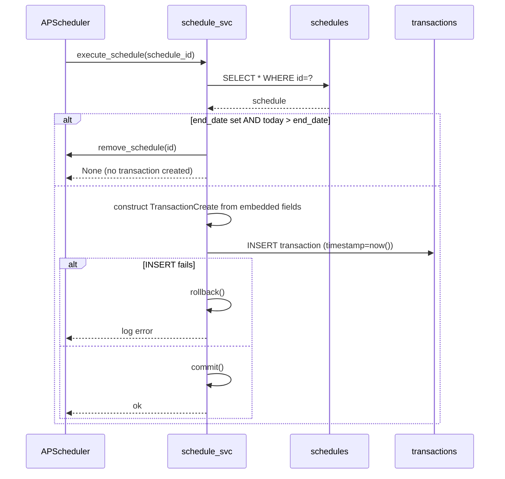
```mermaid
sequenceDiagram
    participant APS as APScheduler
    participant Svc as schedule_svc
    participant DB_sc as schedules
    participant DB_tx as transactions

    APS->>Svc: execute_schedule(schedule_id)
    Svc->>DB_sc: SELECT * WHERE id=?
    DB_sc-->>Svc: schedule
    alt end_date set AND today > end_date
        Svc->>APS: remove_schedule(id)
        Svc-->>APS: None (no transaction created)
    else
        Svc->>Svc: construct TransactionCreate from embedded fields
        Svc->>DB_tx: INSERT transaction (timestamp=now())
        alt INSERT fails
            Svc->>Svc: rollback()
            Svc-->>APS: log error
        else
            Svc->>Svc: commit()
            Svc-->>APS: ok
        end
    end
```

---

#### 8.3 Update / Delete a Schedule

**Update** (`PUT /api/v1/schedules/{id}`)
- Updates the schedule row.
- Calls `sync_schedule(id)` to re-register the APS job with new parameters.
- Changing `total_value`, `entity_id`, `currency`, `type`, or `notes` affects
  ALL future materializations.

**Delete** (`DELETE /api/v1/schedules/{id}`)
- Hard DELETE from `schedules` table.
- Calls `remove_schedule(id)` to remove the APS job.
- **Does NOT** delete any transactions that were already materialized by the
  schedule (they remain in `transactions` as independent records).

---

#### 8.4 Init Scheduler on App Startup

| Field | Value |
| ----- | ----- |
| **Trigger** | Application startup event in `main.py` |
| **Handler** | `init_scheduler()` |

**Sequence**

| Step | Table | SQL |
| ---- | ----- | --- |
| 1 | `schedules` | `SELECT * FROM schedules ORDER BY id` |
| 2 | — | For each schedule: call `_register_job(sched, sch)` which creates an APS job |
| 3 | — | If any jobs registered: `scheduler.start()` |

**Postconditions**
- All active schedules have APS jobs.
- The scheduler is running and will fire jobs at their scheduled times.

---

#### 8.5 Project Future Schedule Occurrences Over a Time Range

| Field | Value |
| ----- | ----- |
| **Trigger** | Frontend Income page loads / user changes date range preset |
| **Handler** | Client-side `computeProjected()` in `income/+page.svelte` |
| **Data Source** | `GET /schedules` (all schedules) + `GET /entities` (entity name map) |

**Algorithm**

```
For each schedule where type IN (MONEY_IN, INTEREST, DIVIDEND):
  1. Advance from schedule.start_date by one periodicity interval
     (skip the first occurrence — it will be created by the scheduler
      firing on start_date).
  2. Continue advancing until >= max(today, range_start).
  3. For each occurrence <= min(schedule.end_date, range_end):
     - Compute the period key (e.g. "2026-07")
     - Add { period, entity_id, entity_name, total_value } to projected dataset
```

**Integration with Chart**

| Step | Data Source | Merge Logic |
| ---- | ----------- | ----------- |
| 1 | `GET /analytics/income-by-source?start_date=RANGE_START&end_date=RANGE_END` | Real transactions within range |
| 2 | `computeProjected(schedules, entityMap, RANGE_START, RANGE_END)` | Projected occurrences (future only) |
| 3 | Merge into `sourceMap[entity_name][period]` | Real + projected summed per period |
| 4 | Build chart labels from range (or from data if range is unbounded) | Monthly labels |
| 5 | Build datasets: one series per entity_name | Stacked bar chart |

**Double-Counting Prevention**
- Projected occurrences start from `advance(start_date, periodicity)` (skip first).
- Only occurrences strictly >= `today` are included (the `effectiveStart` rule).
- This guarantees no overlap with realized transactions (which are created by
  the scheduler fire and thus have `timestamp >= now`).

**Accuracy Note**
- Projection assumes the schedule fires on the exact date computed by the
  periodicity formula. In reality, the scheduler fires at the cron trigger time.
  For MONTHLY schedules with `day = start_date.day`, this is exact. For edge
  cases (Jan 31 → Feb 28), the projection approximates.
- The amount projected is `schedule.total_value` — if the user edits the
  schedule, future projections reflect the new amount. Past clones are
  unaffected.

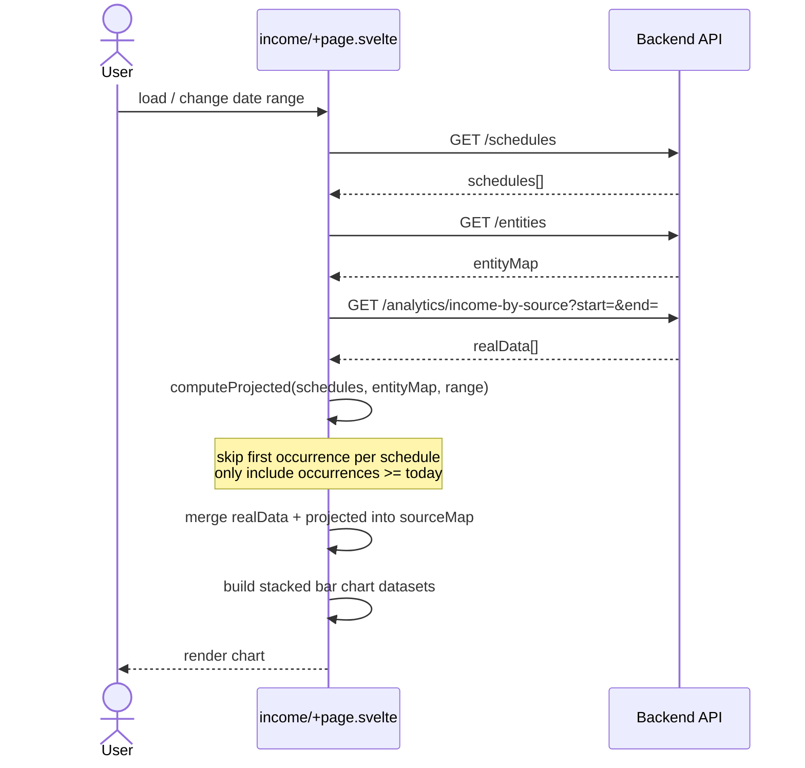
```mermaid
sequenceDiagram
    actor User
    participant FE as income/+page.svelte
    participant API as Backend API

    User->>FE: load / change date range
    FE->>API: GET /schedules
    API-->>FE: schedules[]
    FE->>API: GET /entities
    API-->>FE: entityMap
    FE->>API: GET /analytics/income-by-source?start=&end=
    API-->>FE: realData[]
    FE->>FE: computeProjected(schedules, entityMap, range)
    note over FE: skip first occurrence per schedule<br/>only include occurrences >= today
    FE->>FE: merge realData + projected into sourceMap
    FE->>FE: build stacked bar chart datasets
    FE-->>User: render chart
```

---

### 9. Price

#### 9.1 Record a Price

`POST /api/v1/prices` → INSERT into `prices`.

| Field | Source |
| ----- | ------ |
| `market_code` | Must exist in `market_assets` |
| `timestamp` | When the price was observed |
| `price` | The price value |
| `provider` | Optional data source label |

**Postconditions**
- Used by analytics (`get_holdings`, `get_historical_values`, `get_dashboard`).
- Latest price per `market_code` is determined by `NOT EXISTS (SELECT 1 FROM prices p2 WHERE p2.market_code = p1.market_code AND p2.timestamp > p1.timestamp)`.

#### 9.2 Edit / Delete

Standard PUT/DELETE. No soft delete.

---

### 10. Fiscal Exemption

#### 10.1 CRUD Exemption Rules

Standard CRUD on `fiscal_exemptions` table. Referenced by
`transactions.fiscal_exemption_id`. Hard delete.

| Field | Meaning |
| ----- | ------- |
| `exemption_type` | User-defined label (e.g., "NISA", "ISA", "401k") |
| `exemption_amount` | Monetary allowance |
| `exemption_rate` | Percentage of income/gains exempted (0-100) |
| `exemption_rate_limit` | Cap on the exemption amount (null = no cap) |

---

### 11. Analytics

All analytics are read-only. They aggregate data from `transactions`,
`portfolio_assets`, `market_assets`, `prices`, and `entities`.

#### 11.0 get_cash_balance()

Internal helper used by 11.1. Computes the net cash position across all entities
from realized transactions only. If a `balance_snapshot` exists for a given
`(entity_id, currency)` pair, it is used as the base value and only transactions
strictly posterior to the snapshot's `timestamp` are accumulated.

**Query logic (per entity_id + currency pair)**
```sql
-- 1. Find the most recent snapshot for this pair
SELECT amount, timestamp FROM balance_snapshots
WHERE entity_id = ? AND currency = ?
ORDER BY timestamp DESC LIMIT 1
-- → base_amount (default 0 if none), base_timestamp (default epoch if none)

-- 2. Accumulate transactions after the snapshot
SELECT SUM(
  CASE
    WHEN type IN ('MONEY_IN','INTEREST','DIVIDEND','INVESTMENT_SELL') THEN total_value
    WHEN type IN ('MONEY_OUT','INVESTMENT_BUY') THEN -total_value
    ELSE 0
  END
) AS delta
FROM transactions
WHERE entity_id = ?
  AND currency = ?
  AND timestamp > base_timestamp
  AND timestamp <= datetime('now')

-- 3. cash_balance = base_amount + delta
```

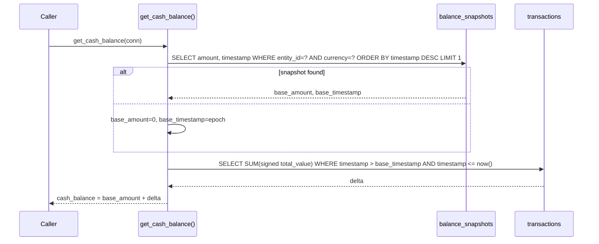
```mermaid
sequenceDiagram
    participant Caller
    participant Fn as get_cash_balance()
    participant DB_bs as balance_snapshots
    participant DB_tx as transactions

    Caller->>Fn: get_cash_balance(conn)
    Fn->>DB_bs: SELECT amount, timestamp WHERE entity_id=? AND currency=? ORDER BY timestamp DESC LIMIT 1
    alt snapshot found
        DB_bs-->>Fn: base_amount, base_timestamp
    else
        Fn->>Fn: base_amount=0, base_timestamp=epoch
    end
    Fn->>DB_tx: SELECT SUM(signed total_value) WHERE timestamp > base_timestamp AND timestamp <= now()
    DB_tx-->>Fn: delta
    Fn-->>Caller: cash_balance = base_amount + delta
```

---

#### 11.1 Dashboard Summary

`GET /api/v1/analytics/dashboard`

| Metric | Computation |
| ------ | ----------- |
| `total_portfolio_value` | Sum of `current_value` from `get_holdings()` |
| `total_invested` | Sum of `total_cost` from `get_holdings()` |
| `cash_balance` | `get_cash_balance()` — see 11.0 |
| `total_return` | `total_portfolio_value - total_invested` |
| `total_return_pct` | `(total_return / total_invested) * 100` |
| `num_holdings` | Count of active portfolio assets |

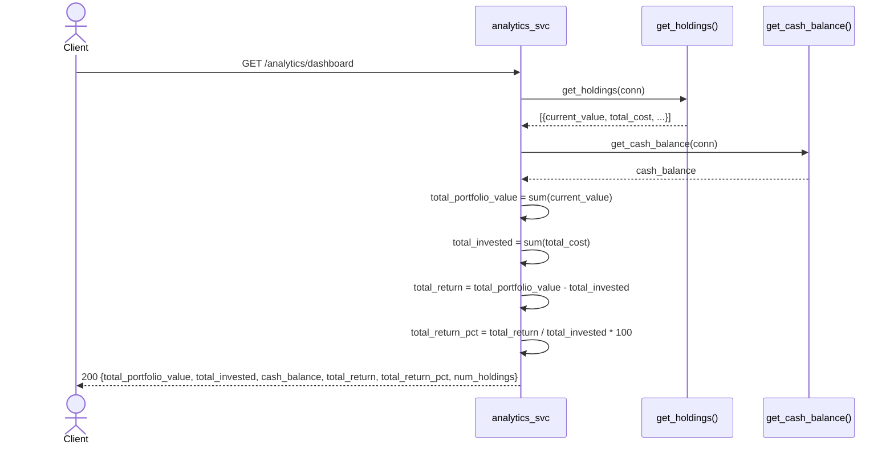
```mermaid
sequenceDiagram
    actor Client
    participant Svc as analytics_svc
    participant Holdings as get_holdings()
    participant Cash as get_cash_balance()

    Client->>Svc: GET /analytics/dashboard
    Svc->>Holdings: get_holdings(conn)
    Holdings-->>Svc: [{current_value, total_cost, ...}]
    Svc->>Cash: get_cash_balance(conn)
    Cash-->>Svc: cash_balance
    Svc->>Svc: total_portfolio_value = sum(current_value)
    Svc->>Svc: total_invested = sum(total_cost)
    Svc->>Svc: total_return = total_portfolio_value - total_invested
    Svc->>Svc: total_return_pct = total_return / total_invested * 100
    Svc-->>Client: 200 {total_portfolio_value, total_invested, cash_balance, total_return, total_return_pct, num_holdings}
```

---

#### 11.2 Holdings with P&L

`GET /api/v1/analytics/holdings`

For each active portfolio asset:
- `net_quantity` = bought - sold (from `transactions` grouped by `portfolio_asset_id`)
- `total_cost` = sum of INVESTMENT_BUY total_values
- `avg_cost` = `total_cost / net_quantity`
- `current_value` = `net_quantity * latest_price` (or `current_value_manual` if tracking_mode = manual)
- `unrealized_pl` = `current_value - total_cost`
- `weight_pct` = `current_value / total_portfolio_value * 100`

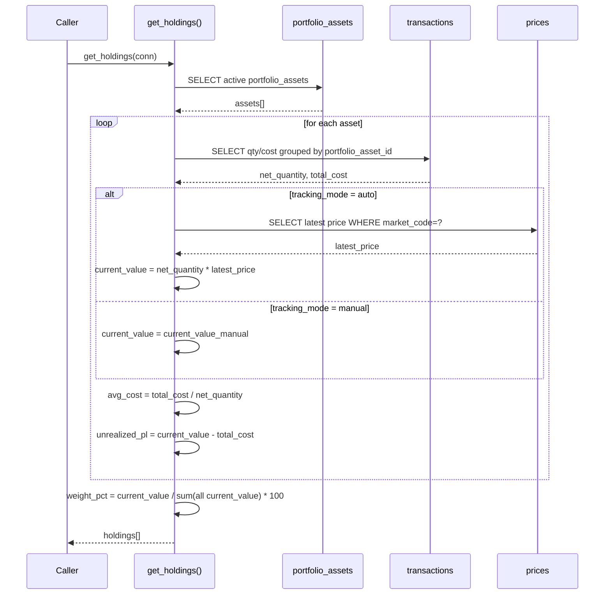
```mermaid
sequenceDiagram
    participant Caller
    participant Fn as get_holdings()
    participant DB_pa as portfolio_assets
    participant DB_tx as transactions
    participant DB_pr as prices

    Caller->>Fn: get_holdings(conn)
    Fn->>DB_pa: SELECT active portfolio_assets
    DB_pa-->>Fn: assets[]
    loop for each asset
        Fn->>DB_tx: SELECT qty/cost grouped by portfolio_asset_id
        DB_tx-->>Fn: net_quantity, total_cost
        alt tracking_mode = auto
            Fn->>DB_pr: SELECT latest price WHERE market_code=?
            DB_pr-->>Fn: latest_price
            Fn->>Fn: current_value = net_quantity * latest_price
        else tracking_mode = manual
            Fn->>Fn: current_value = current_value_manual
        end
        Fn->>Fn: avg_cost = total_cost / net_quantity
        Fn->>Fn: unrealized_pl = current_value - total_cost
    end
    Fn->>Fn: weight_pct = current_value / sum(all current_value) * 100
    Fn-->>Caller: holdings[]
```

---

#### 11.3 Asset Allocation

`GET /api/v1/analytics/allocation?dimension=X`

| Dimension | Grouped By |
| --------- | ---------- |
| `layer` | `portfolio_assets.layer` |
| `asset_type` | `market_assets.asset_type` |
| `currency` | `market_assets.currency_code` |
| `asset_class` | `market_assets.asset_class` |
| `entity` | Primary entity (first transaction's entity) |

#### 11.4 Holdings by Entity (Cross-Tab)

`GET /api/v1/analytics/holdings-by-entity`

Returns `(entity, asset_class, current_value)` triples. The frontend pivots
this into a matrix: rows = entities, columns = asset classes.

#### 11.5 Cash Flow

`GET /api/v1/analytics/cash-flow?group_by=month&start_date=&end_date=`

Groups `transactions` by period expression + type + currency.
- `total_in` = MONEY_IN + INTEREST + DIVIDEND + INVESTMENT_SELL
- `total_out` = MONEY_OUT + INVESTMENT_BUY
- `net` = total_in - total_out

#### 11.6 Income by Source

`GET /api/v1/analytics/income-by-source?group_by=month&start_date=&end_date=`

Filters `type IN ('MONEY_IN', 'INTEREST', 'DIVIDEND')`, groups by period +
`entity_id`, joins `entities` for entity name. Returns `(period, entity_id,
entity_name, total_value, count)`.

#### 11.7 Dividends

`GET /api/v1/analytics/dividends?start_date=&end_date=`

Filters `type = 'DIVIDEND'`, groups by `portfolio_asset_id` + `currency`,
joins for asset metadata.

#### 11.8 Fees & Taxes

`GET /api/v1/analytics/fees-taxes?start_date=&end_date=`

- Fees: joins `transaction_fees` + `transactions`. Fee amounts computed by
  `_compute_fee_amount()`: FIXED uses `fixed_amount`, PERCENTAGE uses
  `percentage * tx.total_value / 100`, BOTH sums them, MIN takes the minimum.
- Taxes: joins `transaction_taxes` + `transactions`. Raw amounts.

#### 11.9 Realized Gains (FIFO)

`GET /api/v1/analytics/realized-gains`

Processes all `INVESTMENT_BUY`/`INVESTMENT_SELL` in chronological order per
portfolio asset. Uses FIFO cost basis: each buy creates a lot with its own
`unit_cost` and `quantity`. On a sell, lots are consumed in FIFO order (oldest
first); `cost_basis = sum of consumed lots' cost`,
`realized_pl = sell_total - cost_basis`. Remaining partial lots carry forward.

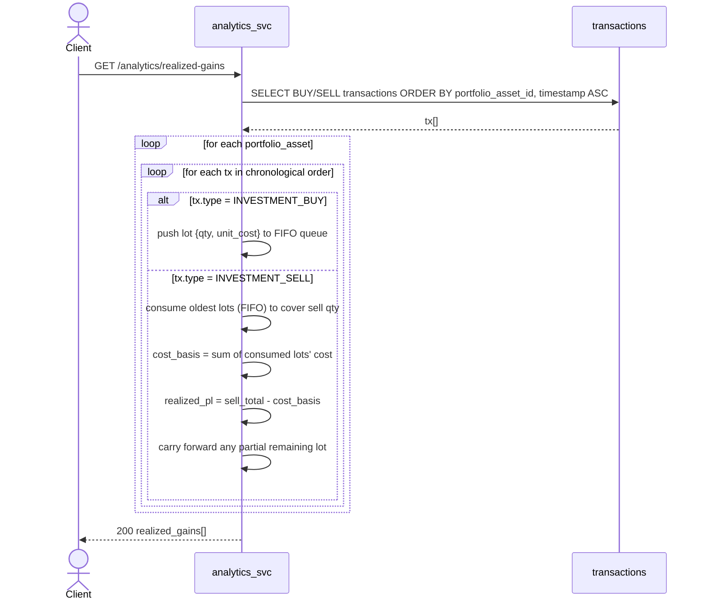
```mermaid
sequenceDiagram
    actor Client
    participant Svc as analytics_svc
    participant DB as transactions

    Client->>Svc: GET /analytics/realized-gains
    Svc->>DB: SELECT BUY/SELL transactions ORDER BY portfolio_asset_id, timestamp ASC
    DB-->>Svc: tx[]
    loop for each portfolio_asset
        loop for each tx in chronological order
            alt tx.type = INVESTMENT_BUY
                Svc->>Svc: push lot {qty, unit_cost} to FIFO queue
            else tx.type = INVESTMENT_SELL
                Svc->>Svc: consume oldest lots (FIFO) to cover sell qty
                Svc->>Svc: cost_basis = sum of consumed lots' cost
                Svc->>Svc: realized_pl = sell_total - cost_basis
                Svc->>Svc: carry forward any partial remaining lot
            end
        end
    end
    Svc-->>Client: 200 realized_gains[]
```

---

#### 11.10 Performance Summary

`GET /api/v1/analytics/performance`

Combines holdings P&L (unrealized) + realized gains into a single summary.

#### 11.11 Historical Portfolio Value

`GET /api/v1/analytics/historical?start_date=&end_date=&interval=month&entity_id=`

For each bucket date in the range:
1. Get net positions as of that date (`get_net_positions_as_of`).
2. Look up the price of each asset as of that date (binary search on sorted
   price history).
3. Sum `net_qty * price` for all positions.
4. Return `(date, total_value)`.

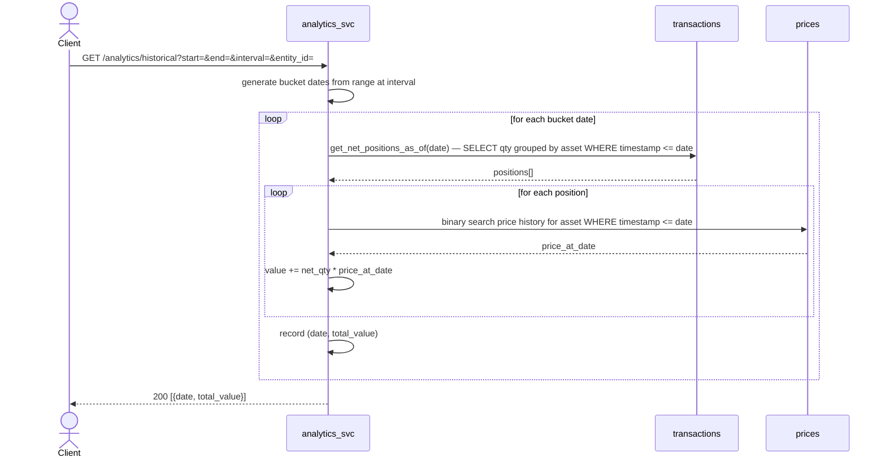
```mermaid
sequenceDiagram
    actor Client
    participant Svc as analytics_svc
    participant DB_tx as transactions
    participant DB_pr as prices

    Client->>Svc: GET /analytics/historical?start=&end=&interval=&entity_id=
    Svc->>Svc: generate bucket dates from range at interval
    loop for each bucket date
        Svc->>DB_tx: get_net_positions_as_of(date) — SELECT qty grouped by asset WHERE timestamp <= date
        DB_tx-->>Svc: positions[]
        loop for each position
            Svc->>DB_pr: binary search price history for asset WHERE timestamp <= date
            DB_pr-->>Svc: price_at_date
            Svc->>Svc: value += net_qty * price_at_date
        end
        Svc->>Svc: record (date, total_value)
    end
    Svc-->>Client: 200 [{date, total_value}]
```

---

### 12. Balance Snapshot

A balance snapshot anchors the cash balance of an `(entity, currency)` pair to
a known absolute value at a point in time. All cash balance computations for
that pair use the snapshot as the base and only accumulate transactions strictly
posterior to it.

**When to use:** when onboarding an existing account whose transaction history
is not available, or when correcting a known drift between computed and real
balance at a specific date.

**Constraint:** no transaction or schedule may have a `timestamp` / `start_date`
earlier than or equal to the most recent snapshot for the same
`(entity_id, currency)` pair. The service layer enforces this on both
`transaction_svc` and `schedule_svc`.

#### 12.1 Create Balance Snapshot

| Field | Value |
| ----- | ----- |
| **Trigger** | `POST /api/v1/balance-snapshots` |
| **Body** | `{ entity_id, currency, amount, timestamp, notes? }` |

**Preconditions**
- `entity_id` exists in `entities` (not soft-deleted).
- `currency` exists in `currencies`.
- No existing transaction for the same `(entity_id, currency)` has `timestamp >= snapshot.timestamp` (checked by service — see integrity note below).

**Sequence**

| Step | Table | SQL | Notes |
| ---- | ----- | --- | ----- |
| 1 | — | Validate FK references (entity, currency) | |
| 2 | `transactions` | `SELECT 1 WHERE entity_id=? AND currency=? AND timestamp >= ? LIMIT 1` | Reject if future transactions exist |
| 3 | `schedules` | `SELECT 1 WHERE entity_id=? AND currency=? AND start_date <= ? LIMIT 1` | Reject if existing schedules predate snapshot |
| 4 | `balance_snapshots` | `INSERT INTO balance_snapshots (entity_id, currency, amount, timestamp, notes)` | |
| 5 | — | `commit()` | |

**Postconditions**
- A new snapshot row exists.
- `get_cash_balance()` for this `(entity_id, currency)` pair now uses this snapshot as its base.
- Any transaction or schedule for this pair must have `timestamp` / `start_date` strictly after this snapshot's `timestamp`.

**Integrity**
- If transactions with `timestamp >= snapshot.timestamp` already exist for the pair, the insert is rejected with 409. The user must either delete those transactions or choose an earlier snapshot date.
- Same check applies to existing schedules with `start_date <= snapshot.timestamp`.
- Only one snapshot per `(entity_id, currency)` is active at a time; a newer snapshot supersedes older ones in `get_cash_balance()` (older rows are retained for audit but ignored in computation).

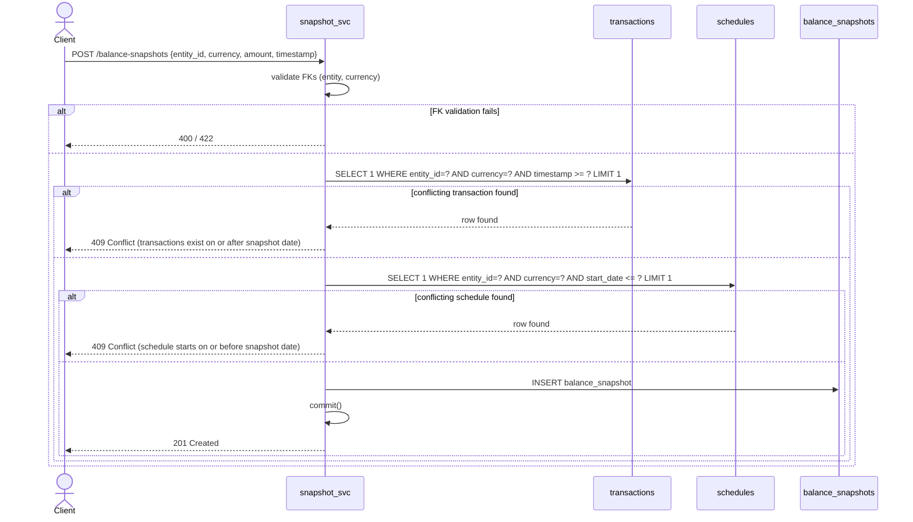
```mermaid
sequenceDiagram
    actor Client
    participant Svc as snapshot_svc
    participant DB_tx as transactions
    participant DB_sc as schedules
    participant DB_bs as balance_snapshots

    Client->>Svc: POST /balance-snapshots {entity_id, currency, amount, timestamp}
    Svc->>Svc: validate FKs (entity, currency)
    alt FK validation fails
        Svc-->>Client: 400 / 422
    else
        Svc->>DB_tx: SELECT 1 WHERE entity_id=? AND currency=? AND timestamp >= ? LIMIT 1
        alt conflicting transaction found
            DB_tx-->>Svc: row found
            Svc-->>Client: 409 Conflict (transactions exist on or after snapshot date)
        else
            Svc->>DB_sc: SELECT 1 WHERE entity_id=? AND currency=? AND start_date <= ? LIMIT 1
            alt conflicting schedule found
                DB_sc-->>Svc: row found
                Svc-->>Client: 409 Conflict (schedule starts on or before snapshot date)
            else
                Svc->>DB_bs: INSERT balance_snapshot
                Svc->>Svc: commit()
                Svc-->>Client: 201 Created
            end
        end
    end
```

#### 12.2 Edit Balance Snapshot

`PUT /api/v1/balance-snapshots/{id}` — updates `amount` or `notes` only.
Changing `timestamp` is not permitted; delete and recreate instead.

#### 12.3 Delete Balance Snapshot

`DELETE /api/v1/balance-snapshots/{id}` → hard DELETE.

- No downstream FK dependencies.
- After deletion, `get_cash_balance()` falls back to the next most recent
  snapshot for the pair, or to summing from zero if none remain.

---

## Integrity Rules Summary

### Referential Integrity

| Rule | Enforcement |
| ---- | ----------- |
| `transactions.entity_id` → `entities.id` | `_resolve_fks` in service layer before INSERT/UPDATE |
| `transactions.currency` → `currencies.code` | Same |
| `transactions.portfolio_asset_id` → `portfolio_assets.id` | Same |
| `transactions.fiscal_exemption_id` → `fiscal_exemptions.id` | Same |
| `transaction_fees.transaction_id` → `transactions.id` | FK constraint at DB level |
| `transaction_taxes.transaction_id` → `transactions.id` | FK constraint at DB level |
| `portfolio_assets.market_code` → `market_assets.market_code` | FK constraint at DB level |
| `prices.market_code` → `market_assets.market_code` | FK constraint at DB level |
| `schedules.entity_id` → `entities.id` | Service-layer validation |
| `schedules.currency` → `currencies.code` | Service-layer validation |
| `schedules.portfolio_asset_id` → `portfolio_assets.id` | Service-layer validation |
| `balance_snapshots.entity_id` → `entities.id` | Service-layer validation |
| `balance_snapshots.currency` → `currencies.code` | Service-layer validation |

### Atomicity Rules

| Flow | Transaction Scope |
| ---- | ----------------- |
| Single transaction INSERT | Single SQL statement (implicit transaction) |
| Full transaction (tx + fees + taxes) | Explicit `commit()` after all INSERTs; `rollback()` on any error |
| Batch transactions | Explicit transaction around all INSERTs |
| Transfer (OUT + IN + fees) | Explicit transaction around 2 tx INSERTs + fee INSERTs |
| Schedule creation | Explicit transaction: schedule INSERT + `sync_schedule` |
| Schedule materialization | Explicit transaction: transaction INSERT; `rollback()` on error |
| Any PUT/UPDATE | Single SQL statement |
| Any DELETE | Single SQL statement (service pre-checks FK dependencies; handles children or returns 409; DB FK is safety net) |

### Deletion Safety

| Entity | Delete Behavior | Service Pre-check |
| ------ | --------------- | ----------------- |
| Entity | Soft delete (SET `deleted_at`) | Transactions or schedules referencing entity → 409 |
| Currency | Hard DELETE (all rows with code) | References in transactions, schedules, market_assets → 409 |
| Market Asset | Hard DELETE | References in portfolio_assets, prices → 409 |
| Portfolio Asset | Hard DELETE | References in transactions → 409 |
| Transaction | Hard DELETE | Service auto-deletes child fees & taxes first, then deletes transaction |
| Transaction Fee | Hard DELETE | Nothing |
| Transaction Tax | Hard DELETE | Nothing |
| Schedule | Hard DELETE | Nothing (materialized transactions are independent) |
| Price | Hard DELETE | Nothing |
| Fiscal Exemption | Hard DELETE | References in transactions → 409 |
| Balance Snapshot | Hard DELETE | Nothing |

### Business Rules

| Rule | Where Enforced |
| ---- | -------------- |
| `type` must be one of 7 transaction types | DB CHECK constraint |
| `periodicity_type` must be one of 7 schedule types | DB CHECK constraint |
| `entity_type` must be one of 5 entity types | DB CHECK constraint |
| `asset_type` must be one of 8 asset types | DB CHECK constraint |
| `layer` must be core/reserve/satellite | DB CHECK constraint |
| `tracking_mode` must be auto/manual | DB CHECK constraint |
| `distribution_type` must be accumulation/distribution/N/A | DB CHECK constraint |
| `dca_status` must be ongoing/paused/closed | DB CHECK constraint |
| Transfer `amount` must be > 0 | Pydantic model validation |
| Transfer entities must differ | Pydantic model validation |
| Cash balance queries exclude future transactions (`timestamp <= now`) | Raw SQL in analytics_queries.py |
| Entity uniqueness: `(name, entity_type)` unique among non-deleted | Service-layer check before INSERT/UPDATE |
